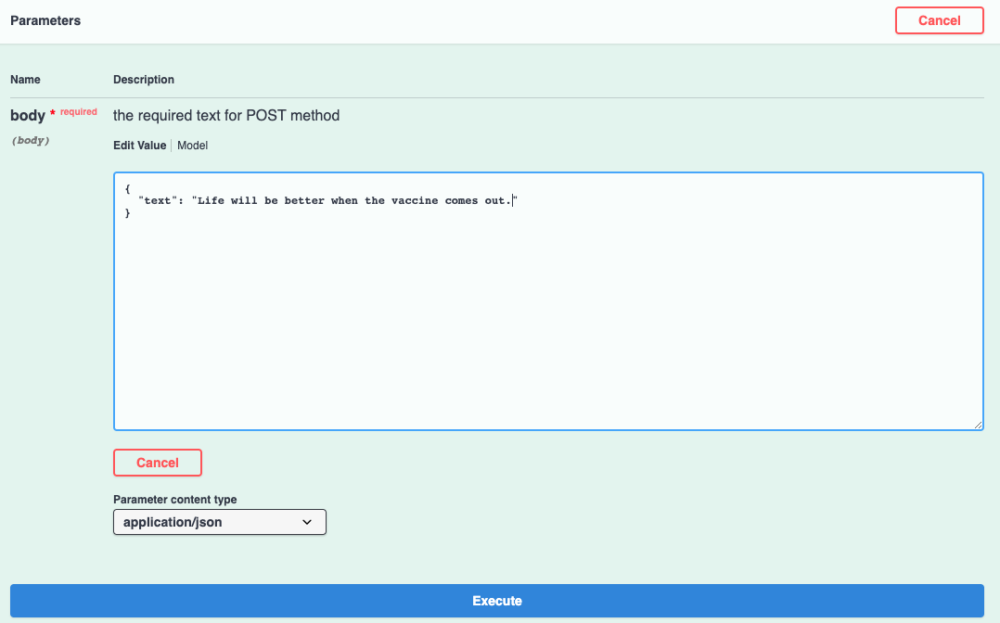
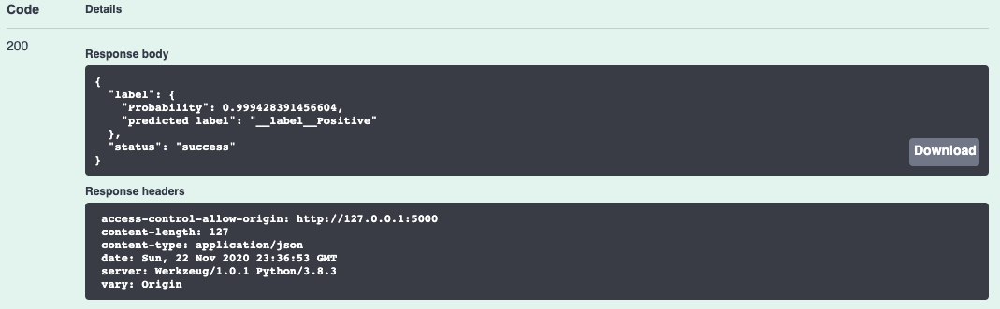

## Individual Project: COVID Text Sentiment Classification


### Run the Flask app 
**Open terminal**
```bash
python api.py
```

**Open browser**: Go to http://127.0.0.1:5000/apidocs/#/default/post_v1_sentiment

**Hit 'Try it out'**: type your comments about COVID in the box to replace **string**



**Hit 'Execute'**: see the prediction of sentiment and probability down below, and you can download the results as a json file


